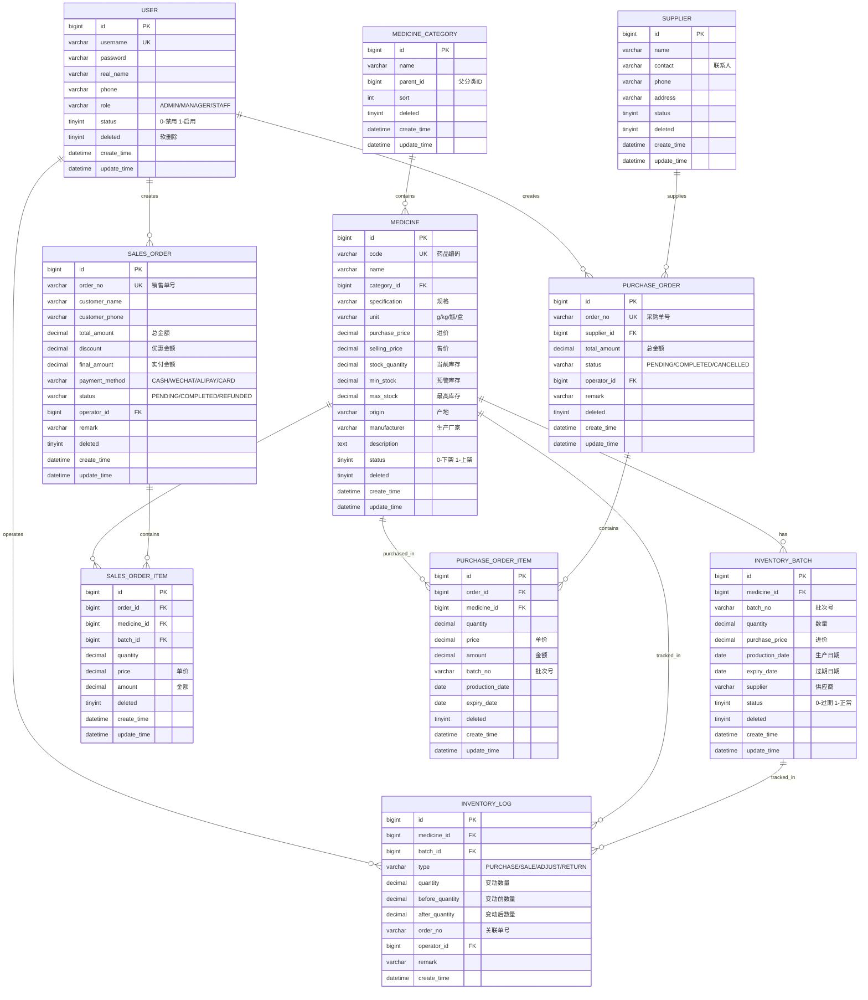

# 中药房库存与销售管理系统

基于 Vue 3 + Spring Boot + MySQL 的中药房管理系统，支持多角色权限管理。

## 数据库 ER 图



## 功能特性

### 核心功能
- **药品管理**: 药品信息的增删改查，分类管理，库存预警
- **库存管理**: 库存批次管理，近效期提醒，库存状态查看
- **销售管理**: 新增销售，订单管理，多种支付方式
- **采购管理**: 新增采购，供应商管理，入库管理
- **报表统计**: 销售报表，库存报表，销售排行，数据可视化
- **用户管理**: 多角色权限控制（管理员/经理/员工）

### 角色权限
| 功能 | 管理员 | 经理 | 员工 |
|------|--------|------|------|
| 首页看板 | ✅ | ✅ | ✅ |
| 药品管理 | ✅ | ✅ | ✅ |
| 库存管理 | ✅ | ✅ | ✅ |
| 销售管理 | ✅ | ✅ | ✅ |
| 采购管理 | ✅ | ✅ | ❌ |
| 报表统计 | ✅ | ✅ | ✅ |
| 用户管理 | ✅ | ❌ | ❌ |

## 技术栈

### 前端
- Vue 3 + Vite
- Element Plus UI框架
- Pinia 状态管理
- Vue Router
- Axios HTTP客户端
- ECharts 数据可视化

### 后端
- Spring Boot 3.2
- MyBatis-Plus ORM
- Spring Security + JWT
- MySQL 8.0
- Lombok

## 快速开始

### 1. 环境要求
- JDK 17+
- Maven 3.6+
- Node.js 16+
- MySQL 8.0

### 2. 数据库准备

```bash
# 登录MySQL
mysql -u root -p

# 创建数据库并导入数据
mysql -u root -p < database/schema.sql
```

### 3. 后端启动

```bash
cd backend

# 修改数据库配置
# 编辑 src/main/resources/application.yml
# 修改数据库连接信息（username, password）

# 安装依赖并启动
mvn clean install
mvn spring-boot:run
```

后端将运行在 http://localhost:8080

### 4. 前端启动

```bash
cd frontend

# 安装依赖
npm install

# 启动开发服务器
npm run dev
```

前端将运行在 http://localhost:5173

### 5. 访问系统

- 访问地址: http://localhost:5173
- 默认账号密码：

| 账号 | 密码 | 角色 |
|------|------|------|
| admin | 123456 | 管理员 |
| manager | 123456 | 经理 |
| staff | 123456 | 员工 |

## 项目结构

```
tcm-pharmacy/
├── frontend/              # Vue 3 前端
│   ├── src/
│   │   ├── layout/        # 布局组件
│   │   ├── views/         # 页面组件
│   │   │   ├── Dashboard.vue    # 首页看板
│   │   │   ├── Login.vue        # 登录页
│   │   │   ├── medicine/        # 药品管理
│   │   │   ├── inventory/       # 库存管理
│   │   │   ├── sales/           # 销售管理
│   │   │   ├── purchase/        # 采购管理
│   │   │   ├── report/          # 报表统计
│   │   │   └── user/            # 用户管理
│   │   ├── router/        # 路由配置
│   │   ├── stores/        # 状态管理
│   │   └── utils/         # 工具函数
│   ├── package.json
│   └── vite.config.js
│
├── backend/               # Spring Boot 后端
│   ├── src/main/java/com/tcm/pharmacy/
│   │   ├── controller/    # 控制器
│   │   ├── service/       # 业务逻辑
│   │   ├── mapper/        # 数据访问
│   │   ├── entity/        # 实体类
│   │   ├── dto/           # 数据传输对象
│   │   ├── config/        # 配置类
│   │   └── util/          # 工具类
│   ├── src/main/resources/
│   │   └── application.yml
│   └── pom.xml
│
├── database/              # 数据库脚本
│   └── schema.sql
│
├── .gitignore
└── README.md
```

## API 接口

### 认证接口
- `POST /api/v1/auth/login` - 用户登录
- `GET /api/v1/auth/me` - 获取当前用户

### 药品管理
- `GET /api/v1/medicine/page` - 分页查询
- `GET /api/v1/medicine/list` - 列表查询
- `POST /api/v1/medicine` - 新增药品
- `PUT /api/v1/medicine` - 更新药品
- `DELETE /api/v1/medicine/{id}` - 删除药品

### 销售管理
- `GET /api/v1/sales/page` - 分页查询
- `POST /api/v1/sales` - 新增销售
- `GET /api/v1/sales/{id}` - 订单详情

### 采购管理
- `GET /api/v1/purchase/page` - 分页查询
- `POST /api/v1/purchase` - 新增采购
- `POST /api/v1/purchase/{id}/complete` - 完成入库

### 报表统计
- `GET /api/v1/report/sales` - 销售报表
- `GET /api/v1/report/sales-ranking` - 销售排行
- `GET /api/v1/dashboard/stats` - 统计数据
- `GET /api/v1/dashboard/sales-trend` - 销售趋势

## 截图

### 首页看板
- 统计卡片（药品总数、今日销售额、库存预警、近效期药品）
- 近7天销售趋势图
- 各类别药材出库占比饼图
- 库存不足药材列表

### 药品管理
- 药品列表（编码、名称、分类、规格、库存等）
- 新增/编辑药品表单
- 搜索筛选功能

### 销售管理
- 销售订单列表
- 新增销售（选择药品、输入数量）
- 订单详情查看

## 开发说明

### 构建生产版本

```bash
# 前端构建
cd frontend
npm run build

# 后端打包
cd backend
mvn clean package
```

### 代码规范

- 后端遵循阿里巴巴Java开发手册
- 前端使用ESLint + Prettier格式化
- 数据库使用软删除策略
- API遵循RESTful设计规范

## 常见问题

### 1. 数据库连接失败
检查 `application.yml` 中的数据库配置，确保MySQL服务已启动。

### 2. 前端启动失败
确保已安装 Node.js 16+，并执行 `npm install` 安装依赖。

### 3. 登录失败
确保数据库已导入初始数据，默认密码为 123456。

## 更新日志

### v1.0.0 (2026-06-07)
- 初始版本发布
- 实现药品管理、库存管理、销售管理、采购管理
- 实现报表统计和数据可视化
- 实现多角色权限管理

## 许可证

MIT License

## 联系方式

如有问题，请提交 Issue 或联系开发者。
