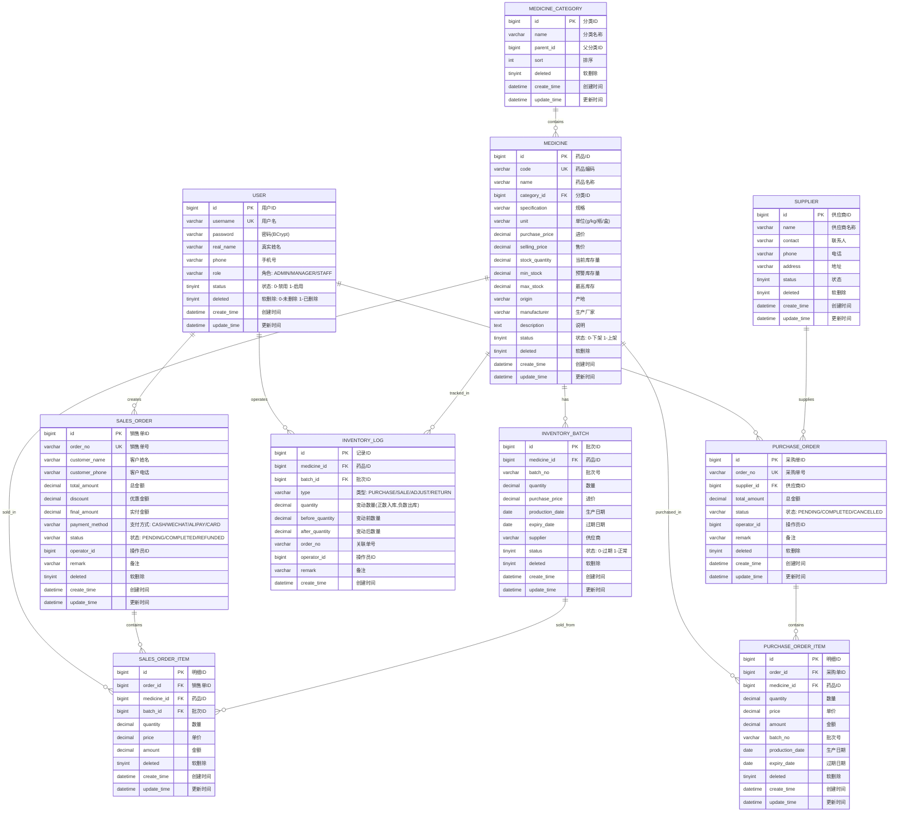

# 中药房管理系统 - 数据库 ER 图

## 概览

本系统包含 10 张核心数据表，采用软删除策略，支持多角色权限管理。

## ER 图

## 表关系说明

### 核心业务流程

1. **采购入库流程**
   - 创建采购单(PURCHASE_ORDER) → 添加采购明细(PURCHASE_ORDER_ITEM) → 完成入库
   - 入库时自动创建库存批次(INVENTORY_BATCH) → 记录库存变动(INVENTORY_LOG) → 更新药品库存(MEDICINE)

2. **销售出库流程**
   - 创建销售单(SALES_ORDER) → 添加销售明细(SALES_ORDER_ITEM)
   - 出库时自动扣减药品库存(MEDICINE) → 记录库存变动(INVENTORY_LOG)

3. **库存管理**
   - 库存批次(INVENTORY_BATCH)管理药品的批次信息，支持先进先出
   - 库存变动记录(INVENTORY_LOG)追踪所有库存变化

### 字段说明

- **软删除**: 所有业务表都使用 `deleted` 字段进行软删除，0表示未删除，1表示已删除
- **状态字段**: 使用整数表示状态，如 0-禁用/下架，1-启用/上架
- **金额字段**: 使用 DECIMAL(10,2) 或 DECIMAL(12,2) 存储，确保精度
- **时间字段**: 自动填充创建时间和更新时间

## 索引说明

### 主要索引

- `medicine.code` - 药品编码唯一索引
- `medicine.name` - 药品名称索引
- `medicine.category_id` - 分类索引
- `sales_order.order_no` - 销售单号唯一索引
- `sales_order.create_time` - 创建时间索引
- `purchase_order.order_no` - 采购单号唯一索引
- `inventory_batch.medicine_id` - 药品ID索引
- `inventory_batch.expiry_date` - 过期日期索引
- `inventory_log.medicine_id` - 药品ID索引
- `inventory_log.create_time` - 创建时间索引

## 初始数据

系统初始化时会创建：
- 1个管理员账户 (admin/123456)
- 7个药品分类 (根茎类、果实种子类、花叶类、全草类、矿物类、动物类、加工类)
- 示例药品数据
- 示例供应商数据
